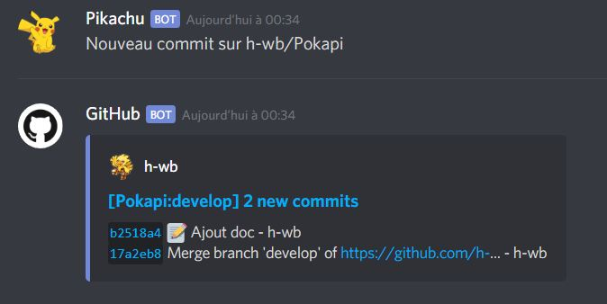
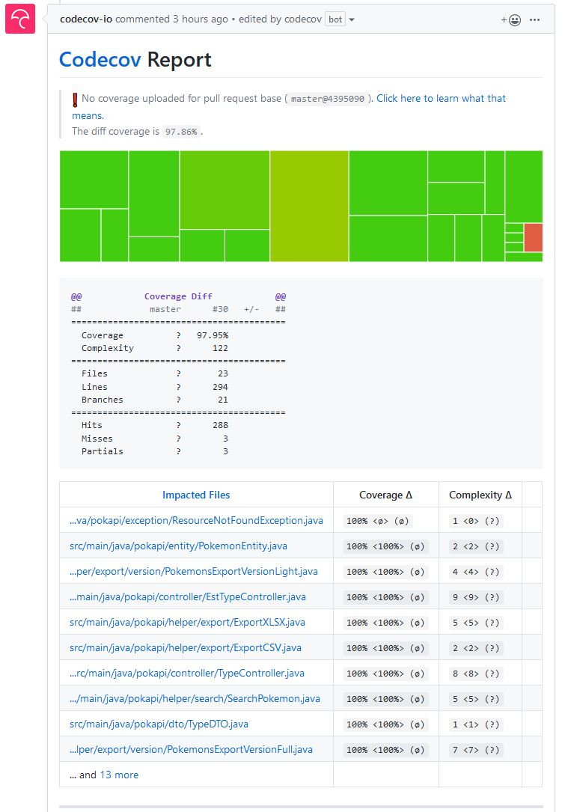
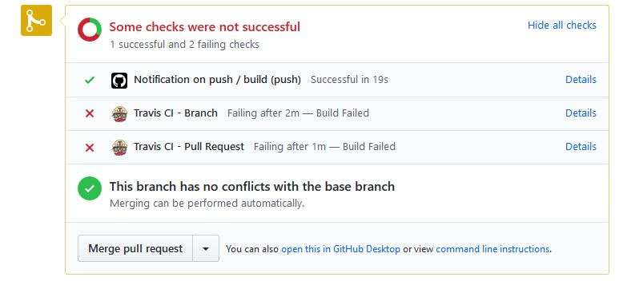
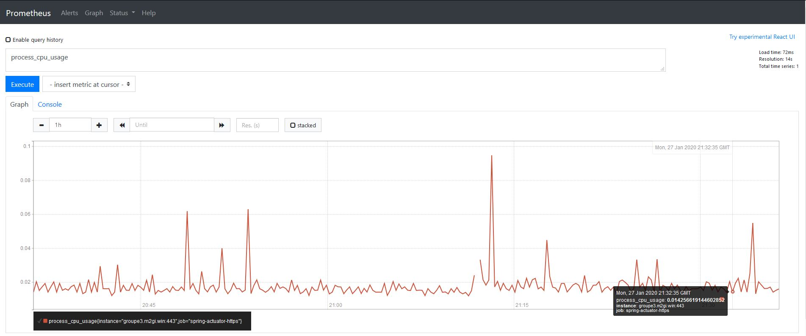
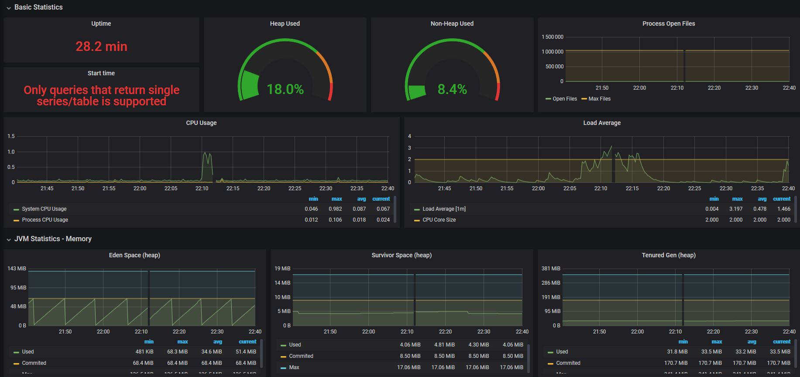

# Nouveau développeur

## Prérequis

Avant de commencer, les outils suivant sont nécessaires :

| Nom              | Version | URL                                                                                  |
|------------------|---------|--------------------------------------------------------------------------------------|
| Maven            | 3.3+    | http://maven.apache.org/download.cgi                                                 |
| JDK              | 8+      | https://www.oracle.com/technetwork/java/javase/downloads/jdk8-downloads-2133151.html |
| Git              | -       | -                                                                                    |
| Eclipse/IntelliJ | -       | https://www.jetbrains.com/idea/                                                      |
| Compte Github    | -       | -                                                                                    |
| Compte Jenkins   | -       | Fourni par les mainteneurs                                                           |

Tous les identifiants pour chacun de services que vous verrez ici sont :

| Identifiant              | Mot de passe |
|------------------|---------|
| admin            | admin    |

Cela sera amené à changer (Voir [Issue #33](https://github.com/h-wb/Pokapi/issues/33))

## Pour commencer

Clonez le dépot :

```bash
git clone https://github.com/h-wb/Pokapi.git
```

Rendez vous dans le répértoire ou le repository a été cloné puis installer le projet :

```bash
mvn clean install
```

Vous êtes désormais prêt à développer sur l'application.

## Outils complémentaires

Afin d'améliorer l'expérience de développement et la qualité du code, plusieurs plugins sont nécessaires.

- Checkstyle : permet d'indiquer les erreurs ne suivant pas le standard de codage défini. Ici la convention suivie est celle de [Sun](https://checkstyle.org/sun_style.html).

- Findbugs : permet de trouver les bugs

### IntelliJ

Rendez vous dans File > Settings > Plugins et installez les plugins.


Après l'installation, redémarrez votre IDE.

#### Checkstyle 
Pour utiliser le plugin checkstyle : Analyze > Inspect Code, les erreurs s'afficheront alors sur votre console


#### Findbugs
Pour utiliser le plugin findbugs : Analyze > FindBugs > Analyze Project Files

### Eclipse

*Prochainement*

## Lancer l'application

Pour lancer l'application on utilise :

```bash
mvn spring-boot:run
```

Ou on lance via IntelliJ ou Eclipse.

L'application sera alors disponible sur [http://localhost:8080](http://localhost:8080), la documentation swagger sur [http://localhost:8080/swagger-ui.html](http://localhost:8080/swagger-ui.html)
et Sprint Boot Admin sur [http://localhost:8080/admin](localhost:8080/admin) (voir [Spring Boot Admin](#spring-boot-admin))
## Pratique de développement

### GitFlow

**develop** est la branche principale.

Lors d'un nouveau développement, il est nécessaire d'ouvrir une branche **feature**.
Chaque nouvelle feature a sa propre branche.

Les branches terminées sont mergées dans **develop** quand elles sont prêtes.
Une **pull request** est alors ouverte, permettant une revue de code avant validation.
Une fois la **pull request** validée, la branche est mergée dans **develop** puis supprimée.

Lors d'une livraison, une branche **release** est créée depuis la branche **develop**, les corrections y seront faites.
Les versions finales sont mergées dans **master** et taguées.

Les corrections critiques sont effectuées dans la branche **hotfix**.
Elles sont mergées dans **develop** et sont mergées et taguées dans **master**.


### Vérification

Après avoir écris du code, on vérifie qu'il n'y a pas de régression :

```bash
mvn verify
```
Cette commande va vérifier que les tests fonctionnent (Dans l'absolu, cela sera vérifié par la [PIC de test](#travis) avant de pouvoir merge le code sur develop). Elle va également vérifier que le checkstyle est 
respécté, dans le cas contraire le verify fail (en 0.2.0 uniquement : Voir [Issue #26](https://github.com/h-wb/Pokapi/issues/26)).

### Commit

Pour commit, on utilisera :

```bash
git commit
```

Votre console vous demandera alors de choisir un gitmoji (suivant [cette convention](https://gitmoji.carloscuesta.me/))


Puis on pushera sur la branche correspondante (feature, hotfix, ... en respectant le [GitFlow](#gitflow))

Chaque commit sera notifié dans le channel #github du [Discord](https://discord.gg/9J8avy) pour permettre de prevenir les reviewers.



### Pull Request

Après avoir push sur votre branche, vous pourrez faire une demande du pull request. Cette pull request sera vérifiée par la [PIC de test](#travis) avec différents outils qui vous notifieront sur cette même
PR.

- Sonarqube : qui va indiquer les bugs, vulnérabilités et code smell


- Codecov : qui va indiquer la différence de coverage entre votre branche et la branche develop



Enfin, votre PR sera résumé par les checks :



Elles indiquent le résultat du build de la [PIC de test](#travis). Ici la [PIC de test](#travis) vérifie que les tests fonctionnent, dans le cas contraire elle retourne un échec.

**Si votre PR a des checks en échec, il y a très peu de change qu'elle soit merge en develop.**

### Post merge

Après votre merge, vous pouvez vérifiez que tout va bien grâce aux outils de [supervision](#supervision) de la [PIC de recette](#jenkins) et que l'application est bien déployée ([https://groupe3.m2gi.win/swagger-ui.html](https://groupe3.m2gi.win/app/swagger-ui.html))

## Documentation

La documentation actuelle est située dans le dossier docs du repository. Sa configuration est située dans .vuepress/config.js. Pour ajouter une page de documentation, on édite le fichier 
.vuepress/config.js. Le dossier api est généré automatiquement par swagger et sa documentation est créée par les annotations spring.

Example :


Elle est générée et déployée sur la branche *gh-pages* du repository automatiquement par la [PIC de test](#travis).

## PIC(s)

### Travis

Travis (**PIC de test**) lance un build de l'application à chaque nouvelle Pull Request. Il permet de vérifier que les tests fonctionnent ou non
et d'en informer le développeur. Il est également responsable du déploiement de la documentation statique.
 
 Il est utilisé car son intégration est très simple et efficace avec Github. 
 
 Son interface est disponible [ici](https://travis-ci.com/h-wb/Pokapi).

### Jenkins 

Jenkins (**PIC de recette**) lance un build de l'application à chaque nouveau commit. Il ne devrait à priori jamais avoir à lancer manuellement de job.
Cependant, si cela est nécessaire cela peut être fait via l'interface [Jenkins](https://jenkins.m2gi.win/).
- Cliquez sur le projet **Pokapi**
- Cliquez sur **Lancer un build**
- Cliquez sur le dernier build lancé (indiqué par le chiffre le plus élévé, représentant le numéro de build)
- Cliquez sur Console Output pour voir le déroulement du build

**Si le build n'est pas en succès, veuillez ouvrir une issue et indiquez l'erreur ou faites une pull request.**

## Supervision

Afin de superviser l'application après un commit sur develop, plusieurs outils sont à votre disposition :


### Sonarqube

[Sonarqube](https://sonarqube.m2gi.win/dashboard?id=gp%3APokapi) permet d'indiquer les bugs, les failles de sécurité, la dette technique et la couverture de code.
Le standard de qualité de ce projet nécessite qu'il n'y ait aucune vulnérabilité et une couverture de plus de 80%.


**Bien qu'il y ait des vérifications préalable. Si des regressions sont amenés sur l'environnement de recette, veuillez ouvrir une issue et indiquez l'erreur ou faites une pull request.**

### Prometheus

Prometheus permet de récuperer des informations de l'application spring et de la machine (*ressources utilisées, nombre de requêtes envoyées, ...*)
Son but premier est de fournir les informations à [Grafana](#grafana) qui va être notre outils de supervision principal.
Cependant, l'interface est tout de même disponible temporairement [ici](http://m2gi.win:9090/graph) (et également [ici](https://groupe3.m2gi.win/prom/new/) : voir [Issue #25](https://github.com/h-wb/Pokapi/issues/25))



**Pour vérifier que l'application spring répond bien, vérifiez son état [ici](http://m2gi.win:9090/targets)**

### Grafana

Grafana est un outil qui permet de visualiser les informations envoyées par prometheus sous forme de différent graphe. Il est l'outil le plus vital pour l'environnement de recette car
il permet d'afficher des informations importantes de façon très visuelle et indicative. Si le dernier déploiement de l'application a un impact sur les performances de l'application, Grafana sera l'indicateur principal.

Pour accéder à l'interface, rendez vous temporairement [ici](http://m2gi.win:9092) (et également [ici](https://groupe3.m2gi.win/grafana/login): voir [Issue #25](https://github.com/h-wb/Pokapi/issues/25)). Vous pouvez également accéder au dashboard utilisé
pour l'application spring [ici](http://m2gi.win:9092/d/spring_boot_21/spring-boot-2-1-statistics?orgId=1)



**Si un des indicateurs dépasse le seuil limite (généralement signalé par la couleur rouge), il est important de le signaler. Ici les informations vitales vont être le *CPU Usage*, le *Memory Allocate*, le *Response Time*, et les *Logback Statistics*. Elles determinent si l'application répond bien et s'il n'y a pas d'erreur**

### Spring Boot Admin

Spring Boot Admin permet également de récuperer les informations envoyées par prometheus. Elle est disponible [ici](https://groupe3.m2gi.win/admin).
Elle est disponible dans un contexte local ([localhost:8080/admin](localhost:8080/admin)) pour avoir des informations avant de commit du code, notamment :
- Les métriques (Aperçus > Métriques)
- Les listes de variables d'environnement (Aperçus > Environnement)
- Les propriétes de configurations (Aperçus > Propriétés de configuration)
- La priorité des logs (Loggers)


**Si l'application Spring n'est pas visible sur Spring Boot Admin, veuillez ouvrir une issue et indiquez l'erreur ou faites une pull request.**

## Tests

### Cucumber

Plusieurs étapes sont nécessaire à l'élaboration de tests avec **Cucumber**

#### Écrire un scénario

La première étape consiste à écrire un scénario, nommé par exemple `src/test/resources/sommes_nous_vendredi.feature`.

Le contenu de ce scénario pourrait être : 

```
Feature: Sommes-nous vendredi ?

  Tout le monde veut savoir quand c'est vendredi

  Scenario: Dimanche n'est pas vendredi
    Given Aujourd'hui nous sommes dimanche
    When  Je demande si c'est vendredi
    Then  Je devrais obtenir la réponse "non"
```

Maintenant que les scénarios sont prêts, utiliser la commande `mvn test` nous permet d'obtenir les fonctions de test manquantes préparées.

```
You can implement missing steps with the snippets below:

@Given("Aujourd'hui nous sommes dimanche")
public void aujourd_hui_nous_sommes_dimanche() {
    // Write code here that turns the phrase above into concrete actions
    throw new io.cucumber.java.PendingException();
}

@When("Je demande si c'est vendredi")
public void je_demande_si_c_est_vendredi() {
    // Write code here that turns the phrase above into concrete actions
    throw new io.cucumber.java.PendingException();
}

@Then("Je devrais obtenir la réponse {string}")
public void je_devrais_obtenir_la_reponse(String string) {
    // Write code here that turns the phrase above into concrete actions
    throw new io.cucumber.java.PendingException();
}
```

#### Compléter les tests

Maintenant que les tests sont prêts, ils faut les compléter pour les faire passer.

Par exemple : 
```
class SommesNousVendredi {
    static String sommesNousVendredi(String today) {
        return "vendredi".equals(today) ? "oui" : "non";
    }
}

public class Stepdefs {
    private String today;
    private String actualAnswer;

    @Given("Aujourd'hui nous sommes dimanche")
    public void aujourd_hui_nous_sommes_dimanche() {
        today = "dimanche";
    }
    
    @When("Je demande si c'est vendredi")
    public void je_demande_si_c_est_vendredi() {
        actualAnswer = SommesNousVendredi.sommesNousVendredi(today);
    }
    
    @Then("Je devrais obtenir la réponse {string}")
    public void je_devrais_obtenir_la_reponse(String string) {
        assertEquals(expectedAnswer, actualAnswer);
    }
}
```

### Mockito

**Mockito** permet de générer automatiquement des objets *mockés*.
Il permet de tester le comportement des objets réels associés à un ou des objets *mockés* facilitant ainsi l'écriture des tests unitaires.

#### Intégration dans les tests

Il est possible d'intégrer Mockito dans les tests Junit de deux façons :
1. Ajouter l'annotation @RunWith(MockitoJunitRunner.class) à la classe de test :
    ```
    @RunWith(MockitoJunitRunner.class)
    public class MyTestClass {
    
    }
    ```

2. Faire appel à la méthode initMocks dans la méthode de SetUp :

    ```
    @Before
    public void setUp() {
        MockitoAnnotations.initMocks(this);
    }
    ```

#### Comportement des objets mockés

Le stubbing permet de définir le comportement des objets mockés face aux appels de méthodes sur ces objets.
Plusieurs méthodes de stubbing sont possibles :

1. Retour d’une valeur unique
    ```
        Mockito.when(pokemon.getName()).thenReturn("Bulbizarre"); //la chaîne de caractères Bulbizarre sera renvoyée quand la méthode getName() sera appelée.
    ```

2. Faire appel à la méthode d’origine
    ```
        Mockito.when(pokemon.getName()).thenCallRealMethod();
    ```

3. Levée d’exceptions
    ```
        Mockito.when(pokemon.getName()).thenThrow(new RuntimeException());
    ```

    Il faut noter que la méthode retournera toujours la valeur stubbée, peu importe combien de fois elle est appelée .
    Si on stubb la même méthode ayant la même signature plusieurs fois, le dernier stubbing sera pris en compte.
        
    ```
        Mockito.when(pokemon.getName()).ThenThrow(new RuntimeException()).ThenReturn("Carapuce");
    ```
    
    Ici le premier appel va lever une exception, tous les appels qui suivront retourneront "Carapuce".
   
4. Retours de valeurs consécutives
    ```
        Mockito.when(pokemon.getName()).thenReturn("Bulbizarre", "Salamèche", "Carapuce");
    ```
   
   Le premier appel retourne Bulbizarre, le deuxième retournera Salamèche le troisième Carapuce.
   Tous les appels qui suivent retourneront la dernière valeur c’est à dire Carapuce.

5. Ne rien retourner
    ```
        Mockito.doNothing().when(pokemon.getName());
    ```

#### Injection

Mockito permet également d’injecter des resources (classes nécessaires au fonctionnement de l’objet mocké), en utilisant l’annotation @InjectMock. 

```
    @InjectMocks
    private TypeController typeController;

    @Mock
    private TypeRepository typeRepository;

    ...

    @Test
    public void getTypeById() throws ResourceNotFoundException {
        TypeEntity typeEntity = new TypeEntity();
        typeEntity.setId(1L);

        when(typeRepository.findById(1L)).thenReturn(java.util.Optional.of(typeEntity));

        ResponseEntity<TypeEntity> returned = typeController.getTypeById(1L);

        verify(typeRepository, times(1)).findById(1L);

        verifyNoMoreInteractions(typeRepository);

        assertEquals(typeEntity, returned.getBody());
    }
```

Mockito associé à Junit permet :

- une écriture rapide de tests unitaires
- de se focaliser sur le comportement de la méthode à tester en mockant les connexions aux bases de données, les appels aux web services, ...

Il ne permet cependant pas de mocker :

- les classes final
- les enums
- les méthodes final
- les méthodes static
- les méthodes private
- les méthodes hashCode() et equals()

Les objets mockés doivent aussi être maintenus au fur et à mesure des évolutions du code à tester.
